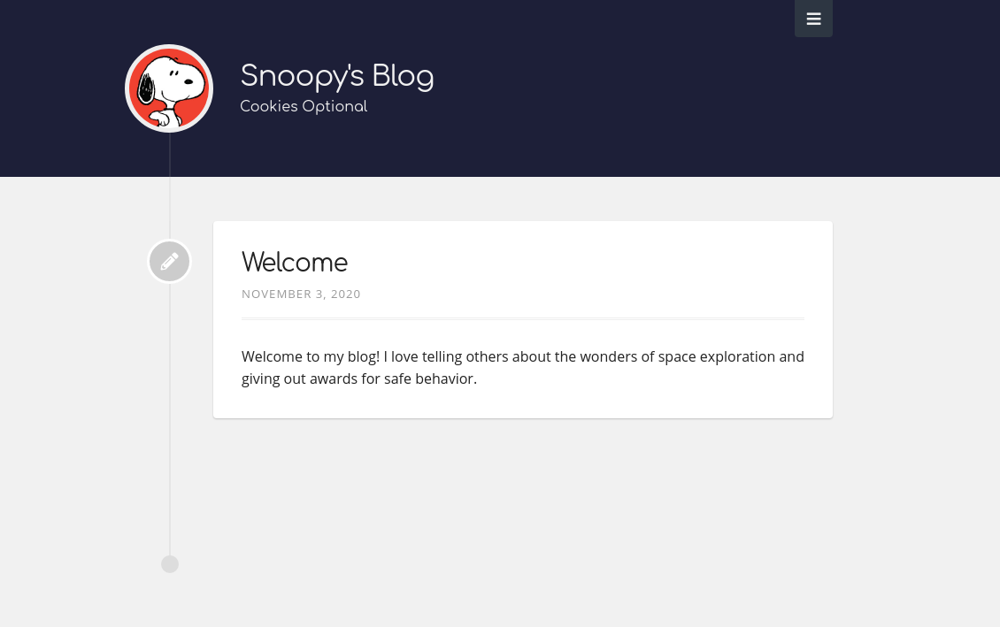

# Hugo Starter Blog
Welcome to the start of your own static site! With the power of [Hugo's](https://gohugo.io) blazing fast framework for creating websites, you can focus on what matters most: content!  

Fork this repository, pick your favorite name for it and let's get started!

## What you will need

- GitHub Account (of course!)
- [Gitpod.io Account](https://gitpod.io) (Don't worry, it's free for public repos for 50 hours/month which is plenty)

## What the end result should look like 
   

Let's get started!
---   

## Setup Checklist
To help you keep track of where you are, follow along with this checklist (sorry you can't just click these boxes, but check each of these off in your head):

- [x] Discover water on the Moon
- [ ] Fork this repository
- [ ] Create a new public GitHub repository with the name **YourUsername.github.io** and initialize with a README
- [ ] Generate a Personal Access Token with admin:repo_hook, repo, workflow privileges
- [ ] Set the GitHub Secrets for *TOKEN*, *USERNAME* and *GHPAGESREPO*
- [ ] Open the repository in Gitpod
- [ ] Modify the config.toml from Gitpod
- [ ] Change the theme from Gitpod
- [ ] Add your first post from Gitpod!

### Task 0: Access
Of course, make sure you are logged in to GitHub and have logged in to [Gitpod](https://gitpod.io) at this point.   
   
### Task 1: Forking
Easy! Just click the little *Fork* button on the top right of this repository.   

### Task 2: New Repo
Click the *+* symbol on the top-right navigation bar and select *New repository*.  
- Make sure the repository name is **YourUsername.github.io** (obviously use your own username) or this won't work  
- Add a description if you want  
- Check the box on the bottom to add a README file  

### Task 3: Personal Access Token
Go to [https://github.com/settings/tokens](https://github.com/settings/tokens) and select *Generate new token*
- Give it a memorable Note like "Github Actions Token"   
- Select the high-level scopes of "repo", "admin:repo_hook", and "workflow"   
- Click *Generate Token* and save the token somewhere safe. GitHub will keep it hidden forever once you leave this page.   

### Task 4: Setting the Secrets
You don't want to worry about building the code for your website and then deploying it each time you make a change right? This repo comes with a GitHub action to automatically publish to the repo you created in task 1. You just have to set the secrets in this forked repo:   
- Make sure you are in YOUR repo where this README file lives
- Click on Settings
- Click on Secrets
- *New Secret* -> USERNAME (type in your GitHub username)
- *New Secret* -> GHPAGESREPO (type in the repository you created in Task 2 e.g., AstroTester.github.io)
- *New Secret* -> TOKEN (paste in the Personal Access Token from Task 3)
- Click on the Code tab to return to the repository

### Task 4.9: Set Gitpod Access Controls
This will grant GitHub write permissions to Gitpod which you will need if you want to easily make website changes from your browser.  
- Go to [gitpod.io/access-control](https://gitpod.io/access-control)
- In the GitHub area, check *write public repos* and *update workflows*
- Click update and grant access

### Task 5: Launch Gitpod
Back to the repository. 
- Go to the URL portion of your browser and modify the URL to insert <u>gitpod.io/#</u> just before the word GitHub.
- It should now look something like: https://gitpod.io/#github.com/AstroTester/hugo-starter-blog
- Go to that link which will open a new Gitpod instance

### Task 6: Modify the Hugo Config
From Gitpod, find the config.toml file and click it. Replace the following values and make sure to preserve double quotes where they exist:
- baseURL: replace the value with https:// + your repository name from Task 2 e.g., baseURL: "https://AstroTester.github.io"
- title: set a title for your website
- author -> name: Type in your name!
- languages -> languages.en -> title: Type in your title again
- languages -> languages.en -> subtitle: Type in a witty subtitle

When you are done, click on the *Source Control* button on the left (looks like a Y under the magnifying glass).
- Hover over the word *Changes* and click the + symbol
- In the *Message* field add a short summary of the changes you just made. e.g., "Customized my config"
- Click the *Checkmark* above the message field to save your changes
- Click on the *Synchronize* button at the very bottom to push your changes to the server. Here is what that button looks like:   

- Wait a minute or two and then check out your website. If you did everything right, you should now be able to access your own website at https://YourUsername.github.io